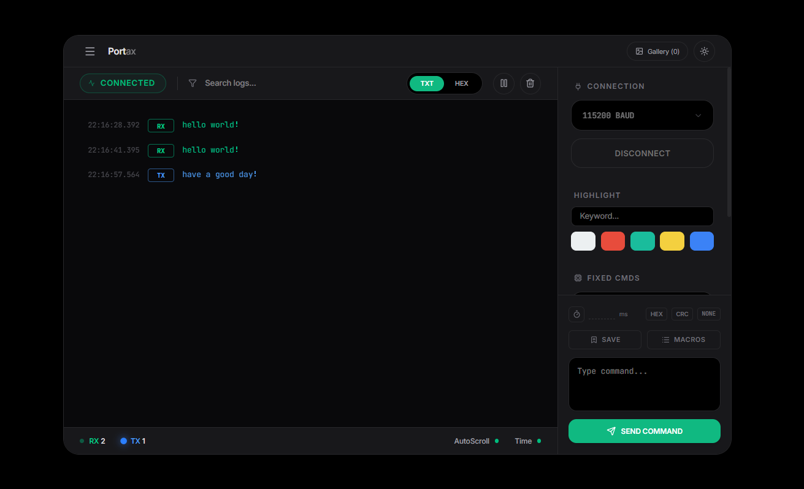
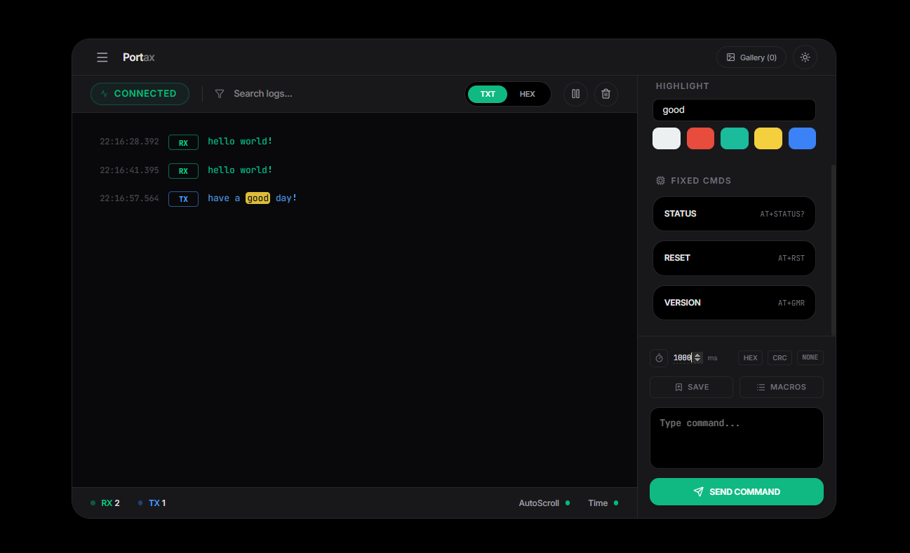
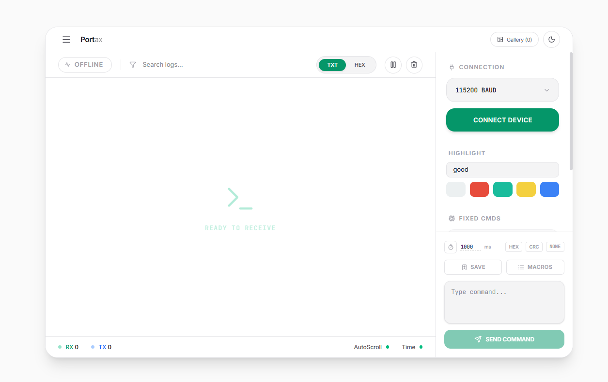
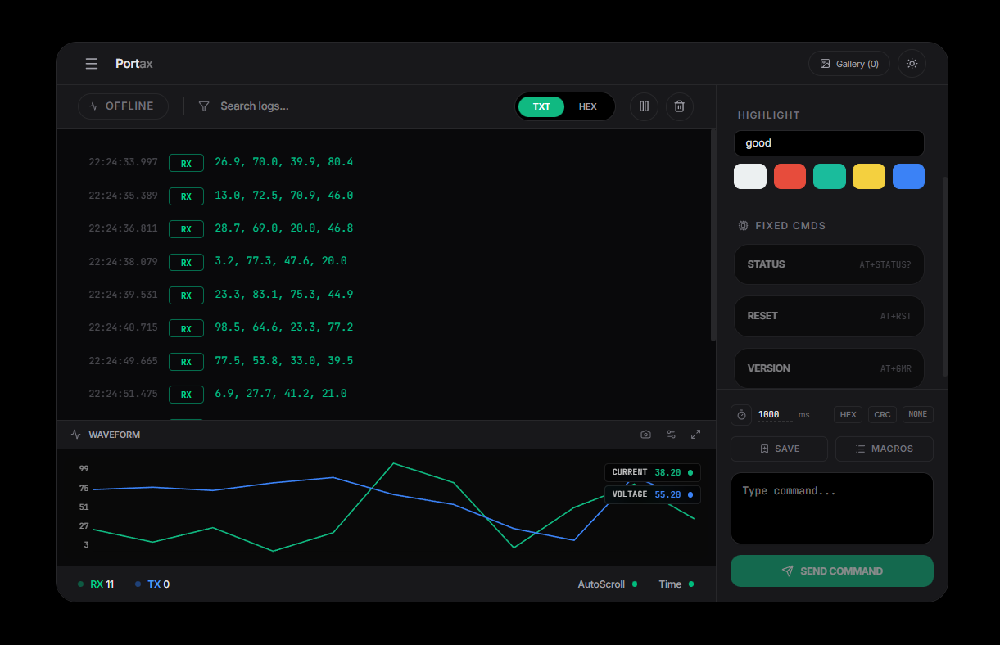

# Portax

[English](./README.md) | [中文](./README_CN.md)

现代化、功能强大的 Web 串口调试工具，界面简洁美观。



## ✨ 功能特性

- **简洁美观的 UI** - 支持深浅主题切换
- **关键词高亮** - 支持自定义关键词高亮及颜色配置
- **⚡ 快捷指令** - 可自定义、持久化保存的快捷指令组
- **历史回溯** - 通过 `↑` / `↓` 键回溯发送历史
- **数据过滤** - 支持实时日志搜索与过滤
- **RX/TX 监控** - 底部状态栏集成动态呼吸灯，实时反馈数据收发状态
- **折线图绘制** - 实时可视化串口数据（测试版）
- **截图导出** - 捕获波形快照并导出为 PDF 报告

## 🚀 快速开始

### 环境要求

- Node.js 16+
- 支持 Web Serial API 的浏览器（Chrome 89+、Edge 89+）

### 安装步骤

```bash
# 克隆项目
git clone https://github.com/your-username/portax.git
cd portax

# 安装依赖
npm install

# 启动开发服务器
npm run dev
```

### 生产构建

```bash
npm run build
```

## 📸 界面预览

**主界面**


**指令管理**


**波形监视器**


**数据导出**


## 🛠️ 技术栈

- **框架**: React 18
- **构建工具**: Vite
- **样式**: Tailwind CSS
- **图标**: Lucide React
- **核心 API**: Web Serial API

## ⚠️ 注意事项

1. **HTTPS 限制** - Web Serial API 仅在 `localhost` 或 `https://` 协议下可用（安全要求）
2. **驱动安装** - 需要安装对应的 USB 转串口芯片驱动（如 CH340、CP2102）
3. **浏览器权限** - 首次连接设备时需通过浏览器弹窗授权

## 🗺️ 开发计划

- [ ] 优化折线图性能
- [ ] Windows 桌面客户端
- [ ] 支持更多协议（Modbus、CANbus 等）
- [ ] 多语言支持
- [ ] 插件系统

## 📄 许可证

GNU GPL v3.0

## 🤝 参与贡献

欢迎贡献代码、提出问题和功能建议！请访问 [Issues 页面]([GitHub · Where software is built](https://github.com/HaxIOX/Portax/issues))。

---

使用 React 和 Web Serial API 开发 ❤️
